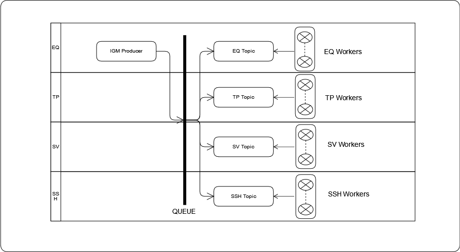

<h1>OPDEFX - Automated IGM profile publication with a ZIO backend</h1>

<h3>Installation Instructions</h3>

1. Install scala & sbt.
2. Clone the project.
3. Edit app.properties file.
4. Open a terminal console.
4. Run sbt "set test in assembly := {}" clean assembly. This command will build a fat jar executable.

<h3>Under the hood</h3>

<h3>TODO</h3>

- [ ] Migrate to ZIO 2.0
- [ ] Add transactional semantics to IGM publications
- [ ] Add retry semantics
- [ ] Improve GUI experience
- [ ] Enhance functionality to support more procedures provided by OPDM we services
